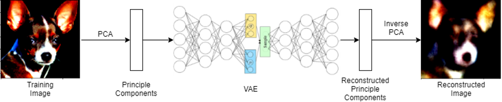
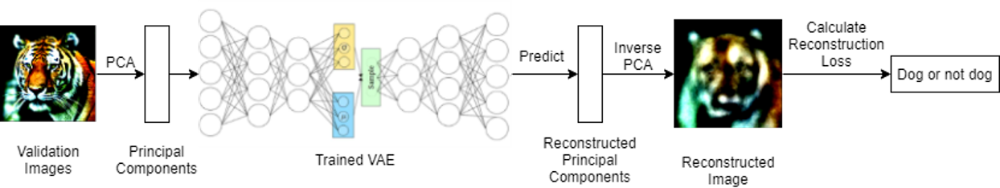
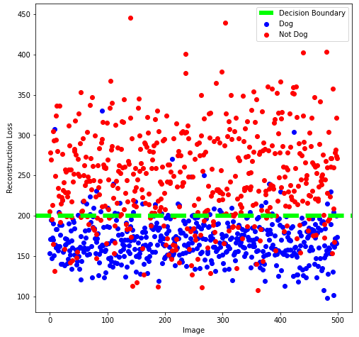

# Dog-Detection-Using-Variational-Autoencoder
## Problem and motivation
Image detection and classification is currently a very important field in machine learning with many useful applications, such as face detection, specific cancer detection, and so on. 
Conventional Image identification using Neural Networks requires Image Labeling. Image Labeling can be a tedious process. 
If we have large datasets of images, and every time we need to build an image identification algorithm for a particular image kind, we need to label the images as ‘instance’ and ‘not instances’. 
So, in this project we train the VAE on dog images so when images from a different distribution are fed into the model, the reconstruction loss is expected to be higher. Then we can classify those two classifications.

## Dataset
This dataset is from Animal Faces on Kaggle. It contains 16,130 images belonging to dogs, cats, and other wildlife. We took 4738 dog images as the training data, and 500 dog images and 500 images of other animals as the validation data.
https://www.kaggle.com/andrewmvd/animal-faces

## Model Training Pipeline

## Classification Pipeline

## Classification Results
Accuracy: 85.5%

False positive rate: 19.8%

False negative rate: 9.2%

High FPR because many animals look similar to dogs

